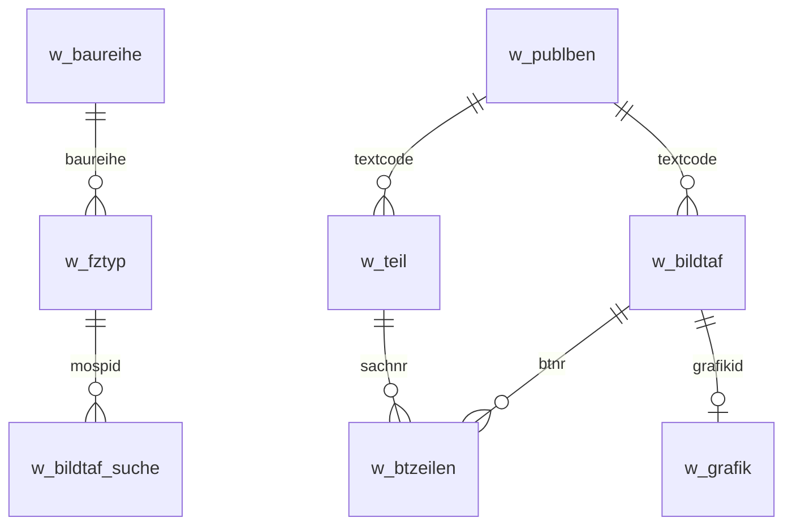

# ETK_PUBL Table Relations

## Primary Entities

### Parts (w_teil)

- **Primary key:** `sachnr` (7-digit part number)
- **Related tables:**
  - `w_btzeilen.btzeilen_sachnr`
  - `w_btzeilen_verbauung.btzeilenv_sachnr`
  - `w_btzeilenugb.btzeilenu_sachnr`
  - `w_btzeilenzub.btzeilenz_sachnr`
  - `w_btzeilenzubugb.btzeilenuz_sachnr`
  - `w_erstbevorratung.eb_sachnr`
  - `w_eu_reifen.reifen_sachnr`
  - `w_fremdtl.fremdtl_sachnr`
  - `w_grp_information.grpinfo_sachnr`
  - `w_hist.hist_sachnr`
  - `w_kompl_einzelteil.ke_sachnr_satz`
  - `w_kompl_satz.ks_sachnr_satz`
  - `w_sft_aspg.sftaspg_sachnr_pg`
  - `w_sftfeder.sftfeder_sachnr_r`
  - `w_si.si_sachnr`
  - `w_tc_performance.tcp_sachnr`
  - `w_tc_performance_allg.tcp_sachnr`
  - `w_tc_sachnummer.tcs_sachnr`
  - `w_teil_aspg.teilaspg_sachnr`
  - `w_teil_atb.teilatb_sachnr_alt`
  - `w_teil_marken.teilm_sachnr`
  - `w_teil_reach.teilreach_sachnr`
  - `w_teil_skip.teilskip_sachnr`
  - `w_teil_spezben.teilsb_sachnr`
  - `w_teileersetzung.ts_sachnr`

### Diagrams (w_bildtaf)

- **Primary key:** `btnr` (diagram number)
- **Related tables:**
  - `w_bildtaf_bnbben.bildtafb_btnr`
  - `w_bildtaf_cp.bildtafc_btnr`
  - `w_bildtaf_marke.bildtafm_btnr`
  - `w_bildtaf_suche.bildtafs_btnr`
  - `w_bildtaf_verweis.bv_btnr_von`
  - `w_bildtafzub.bildtafz_btnr`
  - `w_bildtafzub_baureihe.bildtafzb_btnr`
  - `w_bildtafzub_bedelem.bildtafzbe_btnr`
  - `w_bildtafzub_bedgesamt.bildtafzbg_btnr`
  - `w_bildtafzub_bedog.bildtafzbo_btnr`
  - `w_bildtafzub_bedueber.bildtafzbu_btnr`
  - `w_bildtafzub_bnb.bildtafzb_btnr`
  - `w_bildtafzub_bnb_marketing.bildtafzbnb_btnr`
  - `w_bildtafzub_bnb_refa.bildtafzbnbr_btnr`
  - `w_bildtafzub_cp.bildtafzc_btnr`
  - `w_bildtafzub_einbauinfo.bildtafze_btnr`
  - `w_bildtafzub_einbauinfo_markt.bildtafze_btnr`
  - `w_bildtafzub_komm.bildtafzk_btnr`
  - `w_bildtafzub_marketing.bildtafzm_btnr`
  - `w_bildtafzub_refa.bildtafzr_btnr`
  - `w_bildtafzub_var_marketing.bildtafzvm_btnr`
  - `w_bildtafzub_variante.bildtafzv_btnr`
  - `w_bte_allelem.bteae_btnr`
  - `w_bte_bedelem.btebe_btnr`
  - `w_bte_bedgesamt.btebg_btnr`
  - `w_bte_bedkurz.btebk_btnr`
  - `w_bte_bedog.btebo_btnr`
  - `w_bte_bedueber.btebu_btnr`
  - `w_btzeilen.btzeilen_btnr`
  - `w_btzeilen_cp.btzeilenc_btnr`
  - `w_btzeilen_verbauung.btzeilenv_btnr`
  - `w_btzeilenugb.btzeilenu_btnr`
  - `w_btzeilenugb_verbauung.btzeilenuv_btnr`
  - `w_btzeilenzub.btzeilenz_btnr`
  - `w_btzeilenzub_cp.btzeilenzc_btnr`
  - `w_btzeilenzub_variante.btzeilenzva_btnr`
  - `w_btzeilenzub_verbauung.btzeilenzv_btnr`
  - `w_btzeilenzubugb.btzeilenuz_btnr`
  - `w_btzeilenzubugb_variante.btzeilenzuva_btnr`
  - `w_btzeilenzubugb_verbauung.btzeilenzuv_btnr`
  - `w_komm_help.kommh_btnr`
  - `w_kommugb_help.kommuh_btnr`
  - `w_markt_produkt_br.marktprod_btnr`
  - `w_markt_produkt_var.marktprod_btnr`
  - `w_sft_aspg.sftaspg_btnr`

### Graphics (w_grafik)

- **Primary key:** `grafik_id`
- **Related tables:**
  - `w_baureihe.baureihe_grafikid`
  - `w_baureihe_kar_thb.baureihekar_grafikid`
  - `w_bildtaf.bildtaf_grafikid`
  - `w_etk_grafiken.etkgraf_grafikid`
  - `w_fg_thumbnail.fgthb_grafikid`
  - `w_grafik_hs.grafikhs_grafikid`
  - `w_hauptkategorie.hauptkat_grafikid`
  - `w_hg_thumbnail.hgthb_grafikid`
  - `w_hgfg.hgfg_grafikid`
  - `w_marketingprodukt_grafik.mgraf_grafikid`
  - `w_normnummer.nn_grafikid`
  - `w_normnummergruppe.nng_grafikid`
  - `w_unterkategorie.unterkat_grafikid`

### Multilingual Text (w_publben)

- **Primary key:** `textcode`
- **Related tables:**
  - `w_abk.abk_textcode`
  - `w_bauart.bauart_textcode`
  - `w_baureihe.baureihe_textcode`
  - `w_bed.bed_textcode`
  - `w_bed_aflpc.bedaflpc_textcode`
  - `w_ben_gk.ben_textcode`
  - `w_bildtaf_bnbben.bildtafb_textcode`
  - `w_bildtafzub_bnb.bildtafzb_textcode`
  - `w_btzeilen_verbauung.btzeilenv_textcode`
  - `w_eg.eg_textcode`
  - `w_hauptkategorie.hauptkat_textcode`
  - `w_hgfg.hgfg_textcode`
  - `w_komm.komm_textcode`
  - `w_markt_etk.marktetk_textcode`
  - `w_markt_ipac.marktipac_textcode`
  - `w_netzurl.netzurl_krit_textcode`
  - `w_normteilben.normteilben_textcode`
  - `w_og.og_textcode`
  - `w_teil.teil_textcode`
  - `w_unterkategorie.unterkat_textcode`
  - `w_variante.variante_textcode`

### Vehicle Types (w_fztyp)

- **Primary key:** `mospid` (Model/Series/Production ID)
- **Related tables:**
  - `w_bildtaf_suche.bildtafs_mospid`
  - `w_bildtafzub_bnb_refa.bildtafzbnbr_mospid`
  - `w_bildtafzub_refa.bildtafzr_mospid`
  - `w_bte_allelem.bteae_mospid`
  - `w_bte_bedkurz.btebk_mospid`
  - `w_btzeilen_cp.btzeilenc_mospid`
  - `w_btzeilen_verbauung.btzeilenv_mospid`
  - `w_btzeilenzub_cp.btzeilenzc_mospid`
  - `w_btzeilenzub_verbauung.btzeilenzv_mospid`
  - `w_erstbevorratung.eb_mospid`
  - `w_erstbevorratung_suche.ebs_mospid`
  - `w_fgstnr.fgstnr_mospid`
  - `w_grp_information.grpinfo_mospid`
  - `w_hgfg_mosp.hgfgm_mospid`
  - `w_komm_help.kommh_mospid`
  - `w_sft_aspg.sftaspg_mospid`
  - `w_sftmosp.sftmosp_mospid`
  - `w_tc_kampagne_proddatum.tckp_mospid`
  - `w_tc_performance.tcp_mospid`
  - `w_teileersetzung.ts_mospid`
  - `w_teileersetzung_suche.tss_mospid`
  - `w_teileverwendungfzg_suche.tvs_mospid`

### Series (w_baureihe)

- **Primary key:** `baureihe` (E46, F30, etc.)
- **Related tables:**
  - `w_baureihe_kar_thb.baureihekar_baureihe`
  - `w_bildtafzub_baureihe.bildtafzb_baureihe`
  - `w_bildtafzub_einbauinfo.bildtafze_baureihe`
  - `w_bildtafzub_einbauinfo_markt.bildtafze_baureihe`
  - `w_fuellmengen.fuellmengen_baureihe`
  - `w_fztyp.fztyp_baureihe`
  - `w_markt_produkt_br.marktprod_baureihe`
  - `w_tc_kampagne.tck_baureihen`
  - `w_vbez_pos.vbezp_baureihe`

---

## Core Relationships (Mermaid)



## Key Join Patterns

```sql
-- Parts in diagram
SELECT t.sachnr, t.*, z.menge, z.pos
FROM w_btzeilen z
JOIN w_teil t ON z.btzeilen_sachnr = t.teil_sachnr
WHERE z.btzeilen_btnr = ?

-- Diagram image
SELECT g.grafik_grafik
FROM w_bildtaf b
JOIN w_grafik g ON b.bildtaf_grafikid = g.grafik_id
WHERE b.bildtaf_btnr = ?

-- Part name in language
SELECT p.publben_text
FROM w_teil t
JOIN w_publben p ON t.teil_textcode = p.publben_textcode
WHERE t.teil_sachnr = ? AND p.publben_sprache = 'EN'
```
