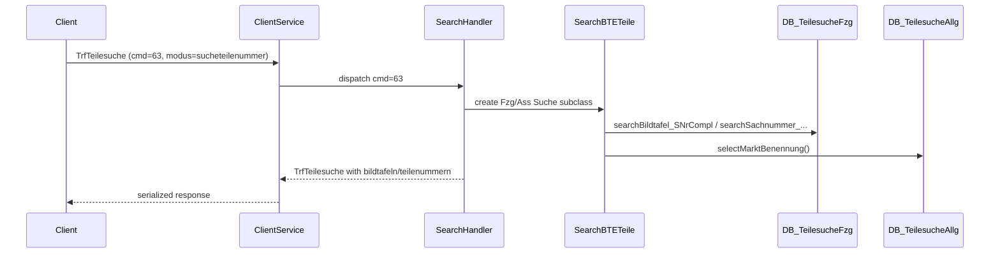
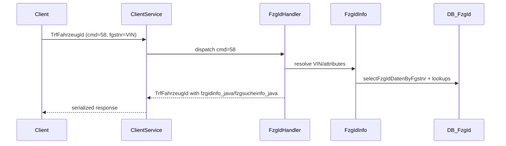
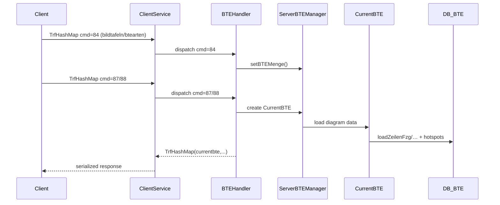
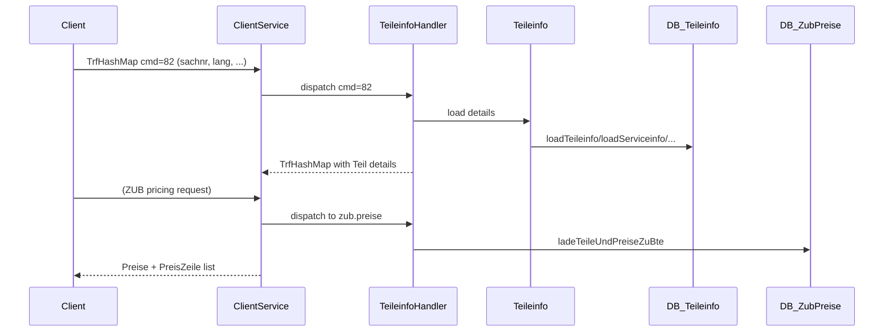

# ETK data flow tracing (key operations)

This document traces the **end‑to‑end** data flow for four key operations, from serialized `Transferable` requests → servlet dispatch → app logic → DB modules → response payload. It builds on the protocol notes in `05-protocol.md` and the SQL module inventory.

> **Note:** The servlet implementation is not present in the decompiled server modules, but per protocol analysis the **`ClientService`** servlet (`/javaserver/ClientService`) receives the serialized `Transferable` and dispatches by `commandID` (see `webetk.communication.Constants.Services`). The app classes below show what handlers must call to fulfill each service.

---

## 1) Part search by number (`teilesucheallgemein` / `teilesuchefzg`)

### Entry point (client)
- **Transferable:** `webetk.communication.transferables.TrfTeilesuche`
- **Service ID:** `PERFORM_TEILESUCHE = 63`
- **Key request fields** (set by `DlgTeilesucheSucheController.performSearchTeilenummer`):
  - `isfzg`: `"true"` or `"false"`
  - `modus`: `"sucheteilenummer"`
  - `hgug`: HG/UG prefix (optional)
  - `sachnummer`: part number query
  - Optional `PSESSID` query param for ASAP
- **Response fields:**
  - `bildtafeln`: `Collection<SearchBTETeile.PartOrBTE>`
  - `teilenummern`: `Collection<SearchBTETeile.PartOrBTE>`
  - `fzgsucheinfo_java` or `asssucheinfo_java`
  - `sachnummersuch` (echo)

### Servlet → handler (server)
- `ClientService` receives `TrfTeilesuche`, inspects `commandID=63`, routes to teilesuche handler.
- Handler chooses **vehicle** vs **accessories** search based on `isfzg` and `modus`.

### App layer (server)
Key classes used to assemble results:
- `webetk.app.SearchBTETeile` – base class for building `PartOrBTE` results.
- **Vehicle parts search:**
  - `webetk.app.fzgsuche.TeileSuche`
  - `webetk.app.fzgsuche.BenennungSuche` / `BegriffSuche` / `HGFGSuche`
- **Accessory/general search:**
  - `webetk.app.basesuche.SachnummernSuche`
  - `webetk.app.basesuche.FremdeTNrSuche`
- `SearchBTETeile.readResultIntoBte()` performs **market lookup** via `teilesucheallgemein.dbaccess`.

### DB modules
- `webetk.db.teilesuchefzg.dbaccess`
  - `searchBildtafel_SNrCompl`, `searchSachnummer_SNrIncompl`, `searchBildtafel_SNrs`, etc.
- `webetk.db.teilesucheallgemein.dbaccess`
  - `selectMarktBenennung(...)` (market labels in results)

### Response assembly
- Handler returns a `TrfTeilesuche` with:
  - `bildtafeln` (BTEs/diagrams) + `teilenummern` (parts)
  - updated `JavaFzgSucheInfo` / `JavaAssSucheInfo`

### Caching
- No dedicated cache for search results in server code; **per‑request DB queries**.
- `SearchBTETeile` caches **market names** only per result; BTE condition lookups may reuse in‑memory `Bedingungsmenge` values in session.

### Sequence diagram (simplified)

### etkx mapping
- **ETK request:** `TrfTeilesuche (cmd 63)`
- **etkx equivalent:** `GET /api/parts/search?q=...&hg=...&fg=...`
  - `PartController.searchParts()` → `PartService.searchParts()`
  - DB side: `PartService` query similar to `teilesuchefzg.dbaccess`

---

## 2) Vehicle lookup by VIN (`fzgid`)

### Entry point (client)
- **Transferable:** `webetk.communication.transferables.TrfFahrzeugId`
- **Service IDs:**
  - `START_FAHRZEUGIDENTIFIKATION = 56`
  - `CHANGE_FAHRZEUGIDENTIFIKATION = 57`
  - **VIN lookup:** `FINALIZE_FAHRZEUGIDENTIFIKATION_WITH_FGSTNR = 58`
- **Key request fields** (from `DlgFzgIdController.doFIByFahrgesellnummer`):
  - `fgstnr`: VIN (7 chars)
  - `marke`, `produktart`, `katalogumfang`
  - `igdom_schnittstelle_kontaktieren`, `sowu_schnittstelle_kontaktieren`
  - `lackcode`, `afcode`

### Servlet → handler (server)
- `ClientService` routes command `58` to **FzgId handler**.

### App layer (server)
- `webetk.app.fzgid.FzgIdInfo`
  - Contains the VIN decoding + product/series/model selection
- `webetk.app.fzgid.FzgIdControlInfo`
  - Supports list selections, attribute‑based identification

### DB modules
- `webetk.db.fzgid.dbaccess`
  - Methods for VIN → vehicle resolution (e.g., `selectFzgIdDatenByFgstnr`)
  - Additional lookups for series/body/model options

### Response assembly
- `TrfFahrzeugId` is populated with:
  - `fzgsucheinfo_java` (vehicle search info)
  - `fzgidinfo_java` (decoded VIN data)
  - optional `bed_zusatz_info` (conditions)

### Caching
- No explicit VIN cache in server code.
- VIN data stored in **session** (`ServerSessionInfo`, `GlobalObjects`) for later workflows.

### Sequence diagram

### etkx mapping
- **ETK request:** `TrfFahrzeugId (cmd 58)`
- **etkx equivalent:** `GET /api/vehicles/vin/{vin}`
  - `VehicleController.decodeVin()` → `VehicleService.decodeVin()`

---

## 3) Diagram retrieval (`bteanzeige` / `visualisierungteil`)

### Entry points (client)
- **BTE list / current diagram (vehicle parts UI):**
  - `SET_BTE_MENGE = 84` (set list of BTEs)
  - `BT_LOAD_BTE = 87` / `BT_SET_CURRENT_BTE = 88`
- **Diagram image:**
  - `GET_IMAGE = 4` with `TrfImage`
- **Part visualization info:**
  - `visualisierungteil` uses `VisualisierungTeil` app class

### Servlet → handler (server)
- Commands `84/87/88` route to BTE handler which uses **`ServerBTEManager`** (session state).
- Command `4` routes to image handler (`ImageCache.requestImageAsByteArray`).

### App layer (server)
- `webetk.framework.ServerBTEManager`
  - Holds **current BTE set** per session (`mcBtNummern`, `mcBtTypen`, current index).
- `webetk.app.bteanzeige.CurrentBTE`
  - Loads diagram metadata + line items + hotspots.
- `webetk.app.visualisierungteil.VisualisierungTeil`
  - Loads part visualization references for selected part number.

### DB modules
- `webetk.db.bteanzeige.dbaccess`
  - `loadZeilenFzg`, `loadZeilenUgb`, `loadHotspots`, `loadBedingungenFzg`
- `webetk.db.visualisierungteil.dbaccess`
  - `retrieveVisualisierungsInfoUgb/…Geb`
- `webetk.db.dbaccess` via `ImageCache` → `loadGrafik` (diagram image blobs)

### Response assembly
- `TrfHashMap` with `currentbte`, `hasnextbt`, `hasprevbt`, etc.
- `TrfImage` with binary image data + `ImageFormat`.
- Visualization returns BTE/graphic references for the part.

### Caching
- **BTE set & current diagram** cached in `ServerBTEManager` (session state).
- **Image cache dir** configured in `ServerGlobalObjects` (`cache.directory`).
- `ImageCache` loads from DB; potential file caching likely handled at servlet/UI layer.

### Sequence diagram

### etkx mapping
- **ETK request:** BTE commands (`84/87/88`) + `GET_IMAGE`
- **etkx equivalents:**
  - `GET /api/catalog/diagrams/{btnr}` → `CatalogService.getDiagram()`
  - `GET /api/catalog/diagrams/{btnr}/image` → `CatalogService.getDiagramImage()`

---

## 4) Part details with pricing (`teileinfo` / `zub/preise`)

### Entry points (client)
- **Part details:** `LOAD_TEILEINFO = 82` (`TrfHashMap`)
- **Accessory pricing:** separate ZUB flow via `zub.preise` DB module

### Servlet → handler (server)
- `ClientService` dispatches cmd `82` to Teileinfo handler.
- Pricing handled by ZUB price loader when accessory context is active.

### App layer (server)
- `webetk.app.teileinfo.Teileinfo`
  - Loads full part details, supersession flags, reach/service info, etc.
- `webetk.app.zub.common.Preise` (pricing model)

### DB modules
- `webetk.db.teileinfo.dbaccess`
  - `loadTeileinfo`, `loadTeileclearing`, `loadServiceinfo`, `checkPreiseGeladen`, …
- `webetk.db.zub.preise.dbaccess`
  - `ladeTeileUndPreiseZuBte` → `ladePreiseZuTeilen` (price DB)
  - `ladeEinbauinfos` (install labor)

### Response assembly
- `TrfHashMap` with part detail objects, plus lists of matching `SearchBTETeile.PartOrBTE` where applicable.
- Pricing response returns `Preise` + `PreisZeile` entries.

### Caching
- No explicit price cache; price data read from **Preis‑DB** connection (`getDBConnectionPreise`).
- Session may keep `Teileinfo` objects for UI reuse.

### Sequence diagram

### etkx mapping
- **ETK request:** `LOAD_TEILEINFO (82)` + ZUB pricing
- **etkx equivalents:**
  - `GET /api/parts/{sachnr}` → `PartService.getPartDetails()`
  - (pricing not yet exposed; candidate extension in `PartService`)

---

## Caching summary (observed)
- **Session state:** `ServerBTEManager` keeps current BTE set & index.
- **Image cache directory:** `ServerGlobalObjects.cache.directory` configures image cache path.
- **In‑memory objects:** `SearchBTETeile`, `CurrentBTE`, `Teileinfo` are often retained in session/UI workflows.

---

## Quick mapping table (ETK → etkx)

| ETK operation | ETK service | etkx endpoint | Service class |
|---|---:|---|---|
| Part search by number | `PERFORM_TEILESUCHE (63)` | `GET /api/parts/search` | `PartService.searchParts` |
| VIN lookup | `FINALIZE_FAHRZEUGIDENTIFIKATION_WITH_FGSTNR (58)` | `GET /api/vehicles/vin/{vin}` | `VehicleService.decodeVin` |
| Diagram retrieval | `BT_LOAD_BTE (87)` + `GET_IMAGE (4)` | `GET /api/catalog/diagrams/{btnr}` + `/image` | `CatalogService` |
| Part details | `LOAD_TEILEINFO (82)` | `GET /api/parts/{sachnr}` | `PartService.getPartDetails` |
