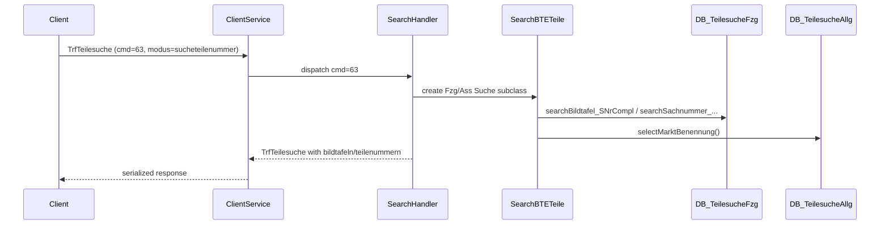
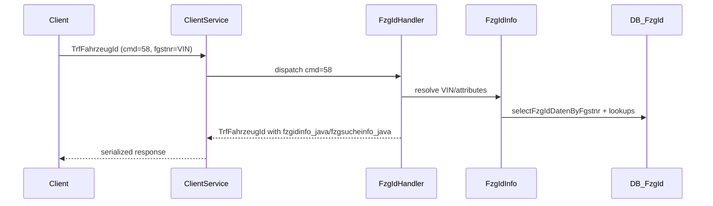
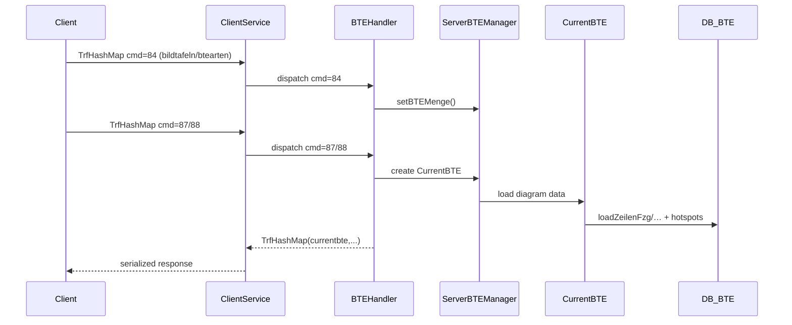
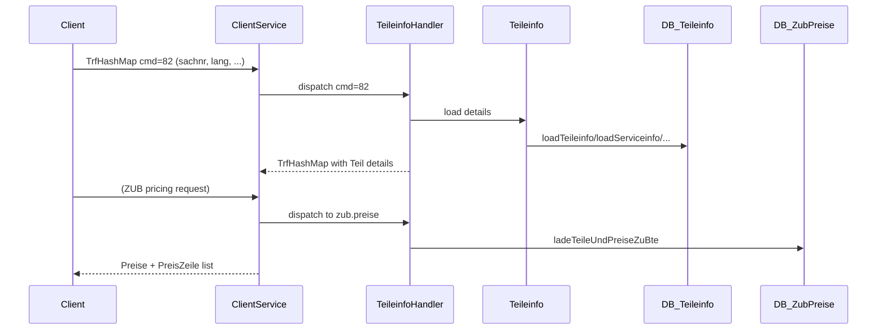

# ETK data flow tracing (key operations)

This document traces the **end‑to‑end** data flow for four key operations, from serialized `Transferable` requests → servlet dispatch → app logic → DB modules → response payload. It builds on the protocol notes in `05-protocol.md` and the SQL module inventory.

> **Note:** The servlet implementation is not present in the decompiled server modules, but per protocol analysis the **`ClientService`** servlet (`/javaserver/ClientService`) receives the serialized `Transferable` and dispatches by `commandID` (see `webetk.communication.Constants.Services`). The app classes below show what handlers must call to fulfill each service.

---

## 1) Part search by number (`teilesucheallgemein` / `teilesuchefzg`)

### Entry point (client)
- **Transferable:** `webetk.communication.transferables.TrfTeilesuche`
- **Service ID:** `PERFORM_TEILESUCHE = 63`
- **Key request fields** (set by `DlgTeilesucheSucheController.performSearchTeilenummer`):
  - `isfzg`: `"true"` or `"false"` (vehicle vs. accessories)
  - `modus`: `"sucheteilenummer"` (part‑number search mode)
  - `hgug`: HG/UG prefix (optional sub‑group scope)
  - `sachnummer`: part number query
  - Optional `PSESSID` query param for ASAP
- **Response fields:**
  - `bildtafeln`: `Collection<SearchBTETeile.PartOrBTE>`
  - `teilenummern`: `Collection<SearchBTETeile.PartOrBTE>`
  - `fzgsucheinfo_java` or `asssucheinfo_java`
  - `sachnummersuch` (echo)

### Servlet → handler (server)
- `ClientService` receives `TrfTeilesuche`, inspects `commandID=63`, routes to teilesuche handler.
- Handler chooses **vehicle** vs **accessories** search based on `isfzg` and `modus`.

### App layer (server)
Key classes used to assemble results:
- `webetk.app.SearchBTETeile` – builds combined BTE (diagram) + part hits for UI lists.
- **Vehicle parts search:**
  - `webetk.app.fzgsuche.TeileSuche` – searches within vehicle context (filters by model/series).
  - `webetk.app.fzgsuche.BenennungSuche` / `BegriffSuche` / `HGFGSuche` – name/term/HG‑FG focused search paths.
- **Accessory/general search:**
  - `webetk.app.basesuche.SachnummernSuche` – base search for part numbers across accessories.
  - `webetk.app.basesuche.FremdeTNrSuche` – searches external/alternate part numbers.
- `SearchBTETeile.readResultIntoBte()` performs **market lookup** via `teilesucheallgemein.dbaccess` so results show localized market names.

### DB modules
- `webetk.db.teilesuchefzg.dbaccess`
  - `searchBildtafel_SNrCompl` — **Purpose:** find diagrams (BTEs) matching a **complete** part number within vehicle catalog.
  - `searchSachnummer_SNrIncompl` — **Purpose:** resolve **partial** part numbers; expands to matching full part records.
  - `searchBildtafel_SNrs` — **Purpose:** list BTEs containing any of the matched part numbers.
  - *(Other variants)* — **Purpose:** support different search scopes (HG/UG, market, validity).
- `webetk.db.teilesucheallgemein.dbaccess`
  - `selectMarktBenennung(...)` — **Purpose:** fetch market/region labels for display so results are localized (e.g., DE/US labels).

### Response assembly
- Handler returns a `TrfTeilesuche` with:
  - `bildtafeln` (BTEs/diagrams) + `teilenummern` (parts)
  - updated `JavaFzgSucheInfo` / `JavaAssSucheInfo`
- **Business context:** the UI needs both **diagram hits** and **part hits** so users can jump to a diagram or open details immediately.

### Caching
- No dedicated cache for search results in server code; **per‑request DB queries**.
- `SearchBTETeile` caches **market names** only per result; BTE condition lookups may reuse in‑memory `Bedingungsmenge` values in session.

### Sequence diagram (simplified)

**Notes:**
- The handler decides **vehicle vs. accessory** search because results must respect different catalogs and validity rules.
- Market labels are fetched separately to keep the core search fast and then decorate results for display.

### etkx mapping
- **ETK request:** `TrfTeilesuche (cmd 63)`
- **etkx equivalent:** `GET /api/parts/search?q=...&hg=...&fg=...`
  - `PartController.searchParts()` → `PartService.searchParts()`
  - DB side: `PartService` query similar to `teilesuchefzg.dbaccess`

---

## 2) Vehicle lookup by VIN (`fzgid`)

### Entry point (client)
- **Transferable:** `webetk.communication.transferables.TrfFahrzeugId`
- **Service IDs:**
  - `START_FAHRZEUGIDENTIFIKATION = 56`
  - `CHANGE_FAHRZEUGIDENTIFIKATION = 57`
  - **VIN lookup:** `FINALIZE_FAHRZEUGIDENTIFIKATION_WITH_FGSTNR = 58`
- **Key request fields** (from `DlgFzgIdController.doFIByFahrgesellnummer`):
  - `fgstnr`: VIN (7 chars)
  - `marke`, `produktart`, `katalogumfang`
  - `igdom_schnittstelle_kontaktieren`, `sowu_schnittstelle_kontaktieren`
  - `lackcode`, `afcode`

### Servlet → handler (server)
- `ClientService` routes command `58` to **FzgId handler**.

### App layer (server)
- `webetk.app.fzgid.FzgIdInfo`
  - **Purpose:** decode VIN into model series, production date, engine/drive, and option codes used to filter parts.
- `webetk.app.fzgid.FzgIdControlInfo`
  - **Purpose:** supports VIN fallback flows (manual selection by attributes when VIN is incomplete).

### DB modules
- `webetk.db.fzgid.dbaccess`
  - `selectFzgIdDatenByFgstnr` — **Purpose:** resolve VIN → vehicle master data (series, body, engine, dates).
  - Other lookups — **Purpose:** fetch selectable options (model/series/body) when VIN is ambiguous.

### Response assembly
- `TrfFahrzeugId` is populated with:
  - `fzgsucheinfo_java` (vehicle search info)
  - `fzgidinfo_java` (decoded VIN data)
  - optional `bed_zusatz_info` (conditions)
- **Business context:** the decoded VIN becomes the **filter context** for all later catalog queries.

### Caching
- No explicit VIN cache in server code.
- VIN data stored in **session** (`ServerSessionInfo`, `GlobalObjects`) for later workflows.

### Sequence diagram

**Notes:**
- VIN decoding is the **gatekeeper** step that determines which parts are valid for the vehicle.
- Attribute fallback lets the UI proceed even when VIN is missing or incomplete.

### etkx mapping
- **ETK request:** `TrfFahrzeugId (cmd 58)`
- **etkx equivalent:** `GET /api/vehicles/vin/{vin}`
  - `VehicleController.decodeVin()` → `VehicleService.decodeVin()`

---

## 3) Diagram retrieval (`bteanzeige` / `visualisierungteil`)

### Entry points (client)
- **BTE list / current diagram (vehicle parts UI):**
  - `SET_BTE_MENGE = 84` (set list of BTEs)
  - `BT_LOAD_BTE = 87` / `BT_SET_CURRENT_BTE = 88`
- **Diagram image:**
  - `GET_IMAGE = 4` with `TrfImage`
- **Part visualization info:**
  - `visualisierungteil` uses `VisualisierungTeil` app class

### Servlet → handler (server)
- Commands `84/87/88` route to BTE handler which uses **`ServerBTEManager`** (session state).
- Command `4` routes to image handler (`ImageCache.requestImageAsByteArray`).

### App layer (server)
- `webetk.framework.ServerBTEManager`
  - **Purpose:** stores the **current set of diagrams** and active index for the session.
- `webetk.app.bteanzeige.CurrentBTE`
  - **Purpose:** loads diagram metadata, line items, and hotspots for the chosen BTE.
- `webetk.app.visualisierungteil.VisualisierungTeil`
  - **Purpose:** resolves diagram/graphic references for a specific part number.

### DB modules
- `webetk.db.bteanzeige.dbaccess`
  - `loadZeilenFzg` — **Purpose:** load line items (parts list) for a vehicle BTE.
  - `loadZeilenUgb` — **Purpose:** load line items for accessory BTEs.
  - `loadHotspots` — **Purpose:** fetch hotspot coordinates that link image to line items.
  - `loadBedingungenFzg` — **Purpose:** retrieve conditions/validity rules for parts on the diagram.
- `webetk.db.visualisierungteil.dbaccess`
  - `retrieveVisualisierungsInfoUgb/…Geb` — **Purpose:** find diagram references for part visualization (accessory/vehicle).
- `webetk.db.dbaccess` via `ImageCache` → `loadGrafik`
  - **Purpose:** fetch the binary diagram image blob from DB.

### Response assembly
- `TrfHashMap` with `currentbte`, `hasnextbt`, `hasprevbt`, etc.
- `TrfImage` with binary image data + `ImageFormat`.
- Visualization returns BTE/graphic references for the part.
- **Business context:** diagrams + hotspots are the **primary UI**, enabling selection of parts by position.

### Caching
- **BTE set & current diagram** cached in `ServerBTEManager` (session state).
- **Image cache dir** configured in `ServerGlobalObjects` (`cache.directory`).
- `ImageCache` loads from DB; potential file caching likely handled at servlet/UI layer.

### Sequence diagram

**Notes:**
- BTE selection is split into **set list** + **load current** so the UI can paginate diagrams.
- Hotspots bind image positions to line items, enabling click‑to‑part behavior.

### etkx mapping
- **ETK request:** BTE commands (`84/87/88`) + `GET_IMAGE`
- **etkx equivalents:**
  - `GET /api/catalog/diagrams/{btnr}` → `CatalogService.getDiagram()`
  - `GET /api/catalog/diagrams/{btnr}/image` → `CatalogService.getDiagramImage()`

---

## 4) Part details with pricing (`teileinfo` / `zub/preise`)

### Entry points (client)
- **Part details:** `LOAD_TEILEINFO = 82` (`TrfHashMap`)
- **Accessory pricing:** separate ZUB flow via `zub.preise` DB module

### Servlet → handler (server)
- `ClientService` dispatches cmd `82` to Teileinfo handler.
- Pricing handled by ZUB price loader when accessory context is active.

### App layer (server)
- `webetk.app.teileinfo.Teileinfo`
  - **Purpose:** loads full part details, supersession flags, reach/service info, and sale restrictions.
- `webetk.app.zub.common.Preise`
  - **Purpose:** pricing model container for accessory price rows.

### DB modules
- `webetk.db.teileinfo.dbaccess`
  - `loadTeileinfo` — **Purpose:** fetch core part attributes (description, units, status, validity).
  - `loadTeileclearing` — **Purpose:** retrieve supersession/replacement info.
  - `loadServiceinfo` — **Purpose:** pull service/maintenance metadata tied to the part.
  - `checkPreiseGeladen` — **Purpose:** verify whether price data already exists for the part.
- `webetk.db.zub.preise.dbaccess`
  - `ladeTeileUndPreiseZuBte` → `ladePreiseZuTeilen` — **Purpose:** load accessory parts and corresponding price rows.
  - `ladeEinbauinfos` — **Purpose:** load installation labor/time data for accessories.

### Response assembly
- `TrfHashMap` with part detail objects, plus lists of matching `SearchBTETeile.PartOrBTE` where applicable.
- Pricing response returns `Preise` + `PreisZeile` entries.
- **Business context:** detailed part view is required for ordering and service workflows; pricing is needed for accessories.

### Caching
- No explicit price cache; price data read from **Preis‑DB** connection (`getDBConnectionPreise`).
- Session may keep `Teileinfo` objects for UI reuse.

### Sequence diagram

**Notes:**
- Part details and accessory pricing are separate because prices live in a dedicated Preis DB.
- Supersession info is critical to guide users from obsolete to valid parts.

### etkx mapping
- **ETK request:** `LOAD_TEILEINFO (82)` + ZUB pricing
- **etkx equivalents:**
  - `GET /api/parts/{sachnr}` → `PartService.getPartDetails()`
  - (pricing not yet exposed; candidate extension in `PartService`)

---

## Caching summary (observed)
- **Session state:** `ServerBTEManager` keeps current BTE set & index.
- **Image cache directory:** `ServerGlobalObjects.cache.directory` configures image cache path.
- **In‑memory objects:** `SearchBTETeile`, `CurrentBTE`, `Teileinfo` are often retained in session/UI workflows.

---

## Quick mapping table (ETK → etkx)

| ETK operation | ETK service | etkx endpoint | Service class |
|---|---:|---|---|
| Part search by number | `PERFORM_TEILESUCHE (63)` | `GET /api/parts/search` | `PartService.searchParts` |
| VIN lookup | `FINALIZE_FAHRZEUGIDENTIFIKATION_WITH_FGSTNR (58)` | `GET /api/vehicles/vin/{vin}` | `VehicleService.decodeVin` |
| Diagram retrieval | `BT_LOAD_BTE (87)` + `GET_IMAGE (4)` | `GET /api/catalog/diagrams/{btnr}` + `/image` | `CatalogService` |
| Part details | `LOAD_TEILEINFO (82)` | `GET /api/parts/{sachnr}` | `PartService.getPartDetails` |
